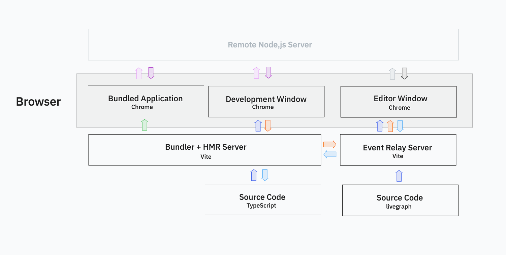

# vite-plugin-escode
A Vite plugin for live-editing arbitrary JavaScript applications

## Features

1. Aggregate all source files with their paths + pass to the Editor through a relay server
2. Transform the source to inject monitoring code that sends back to the original server (or directly to the relay server for production?)

## To Do
1. Parse and render the comprehensive demo code as a graph
2. Replace every variable with a monitorable value in a global store
    - Primitives have getter/setter
    - Objects have Proxies
    - Functions have wrappers
    - Each graph has a pool that indicates the possible global state values that it can hook into, as well as a flow that represents the actual flow of information.
    - Each of these is a node with source declaration + value + an onCodeChange callback that recompiles the whole tree + next + previous
